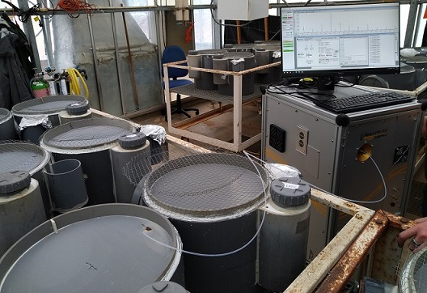
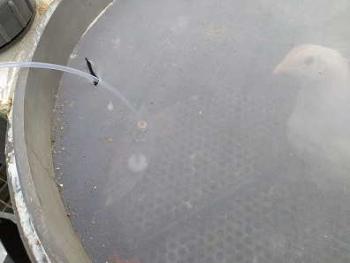

# Introduction générale {-}

À l'instar de l'année 2021, ce stage de M2 a été un peu particulier. Lors de l'élaboration du sujet en janvier, nous avons proposé un sujet résolument tourné vers l'analyse de données. Il s'est avéré que mon temps de stage s'est réparti différemment. Le sujet du stage a évolué afin de mieux couvrir l'ensemble du travail effectué durant ces mois. Le chapitre \@ref(chap1) rend compte de ces aspects en détaillant le contexte de ce stage, l'ouverture qui a été amorcée afin de rendre compatible le travail de la plateforme avec les orientations publiques vers la science ouverte et de la relation entre les analystes et les praticiens.

Le chapitre \@ref(chap2) est dédié à l'instrument de mesure principalement utilisé lors du stage. Le PTR-ToF-MS analyse les molécules volatiles. Après une présentation de cette technique et de notre appareil, je détaillerais les données récupérées ainsi que le package R que j'ai écrit pour procéder à l'analyse. Nous ferons un comparatif entre cette technique et la GC-MS qui est régulièrement utilisé en parallèle.

Enfin, le chapitre \@ref(chap3) détaille les opérations mathématiques utilisées pour l'analyse des données. Je développerais les choix fait quand aux prétraitements et à l'alignement des spectres. Je présenterais également les algorithmes implémentés dans le package, en particulier celui de la MCR-ALS.

À la fin de ce rapport se trouve un glossaire des termes techniques et des acronymes. Avant celui-ci, je livre une conclusion générale sur ce stage ainsi que sur le travail qu'il reste à accomplir. Un soin particulier a été apporté à la découpe des chapitres. Bien que la mode des rapports et articles scientifiques soit au storytelling[^introduction-1], les trois chapitres suivant peuvent se lire dans l'ordre d'intérêt du lecteur.

[^introduction-1]: mode que j'ai toutefois essayé de respecter.

# Le métier d'ingénieur de plateforme {#chap1}

## Contexte

Depuis le 04 novembre 2019, j'occupe un poste d'ingénieur affecté à la Plateforme d'Analyses Chimiques en Écologie (PACE). La PACE, créée en 2000, est spécialisée dans l'analyse chimique pour la communauté de recherche liée à l'écologie, l'environnement et la biodiversité. La PACE comporte six permanents et un CDD. Cette plateforme est un service mutualisé du LabEx CeMEB depuis 2011. L'unité de rattachement est le Centre d'Ecologie Fonctionnelle et Evolutive de Montpellier (CEFE UMR5175 du CNRS). Cette unité mixte possède quatre tutelles ; le CNRS, l'Université de Montpellier (UM), l'École Pratique des Hautes Etudes (EPHE) et l'Institut de Recherche pour le Développement (IRD), ainsi que trois partenaires ; l'Université Paul Valéry Montpellier 3 (UPVM3), SupAgro Montpellier et l'INRAE. À ce titre, bien que rattachée au CEFE, la PACE accueille des projets de recherche issus des 12 unités du CeMEB (850 personnels permanents) mais aussi de toute la communauté académique nationale ou internationale.

L'Université de Montpellier a été porteuse d'un projet GEPETOs dont l'objet était de financer un projet CPER (Contrat Plan Etat Région) mobilisant des financements FEDER pour l'achat d'un spectromètre de masse en temps réel permettant d'atteindre des mesures de cinétique fine, abrégé en PTR-ToF-MS (Proton Transfert Reaction Time of Flight Mass Spectrometry) pour la PACE. Le chapitre \@ref(chap2) revient en détail sur cet instrument. Ce projet GEPETOs comporte une part dédiée au recrutement d'un ingénieur d'étude devant bénéficier d'une formation en double compétence de niveau Master 2. Avec mes responsables hiérarchiques nous avons choisi le M2 SSV qui me permettait de renforcer mes connaissances statistiques. Le stage du second semestre c'est donc effectué sur la plateforme PACE.

Plusieurs étapes ont été définies pour l'ensemble du contrat :

-   mise en place des procédures de recueil et de contrôle des données ;
-   adaptation des méthodes d'analyse mathématiques pour répondre aux besoins spécifiques du PTR-ToF-MS ;
-   organisation de la mise en forme et du stockage des données ;
-   assurer la maintenance des bases de données contenant les data produites par l'instrument et les résultats des analyses.

Il était prévu que le point 2 soit particulièrement mis en avant lors de ce stage. En réalité l'ensemble des points ci-dessus a été mobilisé. Cette introduction du contexte me permet de décrire l'état d'esprit général lié à ce stage. Effectué sur mon lieu de travail, il y avait une dualité entre la nécessité d'encadrer les utilisateurs de la platerforme et la possibilité offerte d'un temps de réflexion et d'exploration. La première modalité imposait le tempo, du pragmatisme et un calendrier à respecter. Ce printemps-été 2021 était particulièrement attendu pour deux raisons. Il fallait en quelque sorte rattraper le travail qui n'avait pu être effectué lors du confinement général du printemps 2020. De plus, les possibilités de l'appareil commence à être connues et celui est beaucoup demandé. De plus, l'intitulé initiale de ce stage était *"Analyse descriptive des données PTR-TOF-MS des COV émis lors du cycle larvaire de la guêpe de l'amande (*Eurytoma amygdali*)*. Je devais accompagné une doctorante dans son travail d'analyse. Nous avons commencé les expériences dés février lors de la période de fleuraison des amandiers. Après deux mois d'expériences, la quantité de données recueillies était particuliérement importante. La doctorante, ayant commencé sa thèse en janvier et après avoir les expériences avec le timing imposé par la nature, a pu reprendre un rythme normale de thèse et se plonger dans la bibliographie.

De mon coté, j'ai participé à la mise en place d'autres expériences sur lesquelles nous reviendront dans ce rapport. J'ai également pu prendre du recul sur mon activité et la repenser afin qu'elle cadre avec la politique actuellement de science ouverte. Ce stage m'a ainsi permit d'orienter les outils numériques que je met à dispositions des chercheurs vers une science reproductible.

## Science ouverte

Durant cette période de stage, le gouvernement français a mis en place le Deuxième Plan pour la science ouverte qui définit les actions mises en place sur la période 2021-2024. Le plan est détaillé dans ce [document](https://www.ouvrirlascience.fr/wp-content/uploads/2021/06/Deuxieme-Plan-National-Science-Ouverte_2021-2024.pdf) dont je recommande vivement la lecture. Ce guide de route possède les défauts propres à l'époque[^introduction-2]. Ceci étant, à l'échelle de la communauté scientifique française, ce plan permettra une large diffusion du savoir et de la culture scientifique grâce à des actions regroupés dans quatre axes :

[^introduction-2]: pêle-mêle l'utilisation abondante de mots valises, la volonté de récompenser les bons élèves par des badges et des prix ou encore permettre la libre exploitation de la recherche publique à des entreprises qui ne respectent pas leur devoir fiscal

-   généraliser l'accès ouvert aux publications;
    - généraliser l’obligation de publication en accès ouvert des articles et livres issus de recherches financées par appel à projets sur fonds publics;
    - soutenir des modèles économiques d’édition en accès ouvert sans frais de publication pour les auteurs;
    - favoriser le [multilinguisme](https://youtu.be/7Gp4e5YnQa8?t=147)^[Découvrir l’étrangeté d’une pensée en langue étrangère constitue une expérience herméneutique fondamentale, étant donné qu’une telle rencontre peut déclencher un processus qui contribue à augmenter l’incertitude positive et à remettre en cause les convictions propres pour construire ainsi une barrière contre l’ethnocentrisme dans la pensée scientifique. @hamel_2013 ] et la circulation des savoirs scientifiques par la traduction des publications des chercheurs français; 
-   structurer, partager et ouvrir les données de la recherche;
    - mettre en œuvre l’obligation de diffusion des données de recherche financées sur fonds publics;
    - créer Recherche Data Gouv, la plateforme nationale fédérée des données de la recherche;
    - promouvoir l’adoption d’une politique de données sur l’ensemble du cycle des données de la recherche, pour les rendre faciles à trouver, accessibles, interopérables et réutilisables (FAIR);
-   ouvrir et promouvoir les codes sources produits par la recherche;
    - valoriser et soutenir la diffusion sous licence libre des codes sources issus de recherches financées sur fonds publics;
    - mettre en valeur la production des codes sources de l’enseignement supérieur, de la recherche et de l’innovation;
    - définir et promouvoir une politique en matière de logiciels libres;
-   transformer les pratiques pour faire de la science ouverte le principe par défaut.
    - développer et valoriser les compétences de la science ouverte tout au long du parcours des étudiants et des personnels de la recherche;
    - valoriser la science ouverte et la diversité des productions scientifiques dans l’évaluation des chercheurs et enseignants-chercheurs, des projets et des établissements de recherche;
    - tripler le budget de la science ouverte en s’appuyant sur le Fonds national pour la science ouverte et le Programme d’investissements d’avenir  
    

Les axes concernant le code et les données me concerne directement. Par mon travail, je produit des données ainsi que le code permettant l'analyse de celle-ci par mes collaborateurs. Le code est écrit en langage R sous la forme d'un package, *proVOC*, déposé sur [gitHub](https://github.com/JHuguenin/provoc). Il génère un workflow qui sauvegarde les paramètres et les données utilisés lors de l'analyse. Le dépôt sur un git permet l'ouverture de ce code. Il est toutefois prévu d'effectué une migration sur gitLab afin de favoriser l'utilisation des logiciels libres.

Par ailleurs, je souhaite développer un module permettant de convertir les data machines dans un format adapté à la futur plateforme Recherche Data Gouv. Ce module facilitera la production de *data paper* dont j'ai découvert l'existence au cours des [journées casuHAL 2021](https://casuhal2021.sciencesconf.org/). Grâce à deux demi-journées de formation sur Rmardown et sur la création de package, j'ai pu intégrer la génération de rapport automatisé dans le package[^introduction-3] qui est un premier pas vers l'écriture automatisé des data paper.

J'ai également découvert et testé les packages et templates permettant de créer sous R un document découpé en chapitre. J'utilisais déjà Rmarkdown depuis un certains temps mais le passage à [Bookdown](https://bookdown.org/) et [memoiR](https://ericmarcon.github.io/memoiR/) a demandé un temps d'adaptation plus long que prévu. Ceci étant, ça n'a pas été en vain puisque j'ai eu plusieurs retours enthousiastes de collègues en vu d'une formation sur ces packages. J'envisage, une fois ce rapport terminé, de développer un clone de memoiR (avec l'accord de l'auteur) sur le style de [EcoFoG](https://ecofog.github.io/EcoFoG/) afin de mettre à disposition aux membres du CEFE un templates clé en main. Ceci permettra de favoriser l'écriture de rapport par des logiciels libres et d'améliorer la reproductibilité de la science. 

[^introduction-3]: <https://daranzolin.github.io/2021-03-03-automated-rmarkdown/>

## Plan d'expérience en écologie chimique

Le chapitre suivant décrit la technique de la PTR-ToF-MS. Nous avons ici juste besoin de savoir que cette technique analyse en continue les molécules volatiles émises par l'échantillon. L'instrument ne peut analyse que un échantillon à la fois mais plusieurs peuvent se succéder au sein de séquence.

Durant la période de stage, j'ai accompagné plusieurs séries d'expériences. Les modèles biologiques analysés varient à chaque expérience. Les plans d'expériences ont été conçu en dialoguant avec les utilisateurs. Bien souvent, ils avaient en tête l'expérience qui répondait le mieux possible à leur question biologique. J'anticipais les incohérences techniques et j'optimisais les paramètres de l'instrument. Avec le recul, je me suis rendu compte que mes connaissances acquissent en cours de recueil planifié de données n'étaient pas pleinement exploité.  

Un des problèmes principales est dû à la contamination de la ligne et de l'instrument par l'échantillon précédent. Nous pouvons analyser ces expériences pour repérer les erreurs commises.

### Détection des traces d'un complément alimentaire

Cette expérience avait pour objectif de mesurer la diffusion de l'odeur de nourriture (pour des poules) dans quatre sites d'un mésocosme constitué de deux compartiments. La figure \@ref(poule1) illustre cette prise de mesure. Les sites étaient localisés dans la mangeoire (s1, compartiment 1), au centre du compartiment 1 (s2), à la jonction des deux compartiments (s3, côté comportiment 2, figure \@ref(poule2)) et au fond du compartiment 2 (s4). La nourriture au sein de la mangeoire était soit de la nourriture témoin (T) soit dopée par de l'huile essentiel (A et B). Il y avait 5 mésocosmes pour chaque modalité.  

{#poule1}

Dans la théorie d'une expérience totalement randomisée, il aurait fallut définir l'ordre aléatoire de chacune des 60 acquisitions^[5 (mésocosmes) x 3 (modalité) x 4 (site d'acquisition) = 60]. Dans la pratique, cette expérience nécessitait de déplacer l'instrument d'un mésocosme à l'autre entre chaque acquisition. Cette manipulation aurait drastiquement augmenté la durée de l'expérience. Nous avons donc tiré au hasard l'ordre de passage de chaque mésocosme, effectué un blanc et les acquisitions sur les quatre sites de mesures puis terminé par un nouveau blanc. 

Il aurait été juste de tirer au hasard l'ordre de passage des sites. Pour autant, nous avons opté pour une hypothèse forte de commencer par la site le plus éloigné de la mangeoire (s4, s3, s2, s1) afin que les potentielles traces ne soient pas contaminées par une odeur plus forte. Dans les faits, nous laissions assez de temps entre deux mesures pour renouveler plusieurs fois le volume d'analyse à l'intérieur de l'instrument ce qui permettait d'isoler les mesures. Après coup, je pense qu'il aurait été bon de procédé malgré tout à une randomisation de l'ordre des sites au sein d'un mésocosme.

Nous avions également une seule journée pour effectuer l'ensemble des acquistions, ce qui a été juste suffisant. Nous n'avons pas pu effectuer de répétition sur un même échantillon. L'analyse des data a été effectué par le post-doc en charge de l'expérience. Je n'ai pas de retour sur des potentiels contaminations intra et inter échantillons.  

Bien que la réalisation de cette expérience est statistiquement discutable, elle a été réalisé en tout début de la période de stage et m'a permit la réflexion sur comment intégrer mieux la planification d'expérience.  

### Caractérisation de COV de l'amandier  {#expalm}  

Ce travail s'inscrit dans la première année d'un projet de thèse et consistait à analyser les COV émis par les différents organes (bourgeon, fleur, feuille, fruit) des amandiers. Pour des raisons de calendrier, j'ai aidé à la mise en place des expériences début février puis à la formation de la doctorante. Une fois cette dernière autonome avec l'instrument, j'ai peu assisté au suivi de l'expérience. J'ai toutefois soumis l'idée de suivre le débourrement d'une fleure avec le PTR-ToF-MS.   

Nous avons suivi durant un week-end les COVs émis par un bourgeon que nous avons isolé du reste de la plante. Ce bourgeons avait été sélectionné car il était proche de la floraison. Ainsi, nous avons pu recueillir les odeurs émises avant, pendant et après le débourrage. Cependant, nous n'avons pu obtenir qu'une seule unité expérimentale pour cette expérience. Par ailleurs, nous avions filmé le bourgeons durant l'expérience mais la caméra s'est éteinte après quelques heures. Ainsi, nous n'avons pas de témoin validant l'heure de phénomène.  Les données techniques et les résultats de l'analyse sont détaillés à la section \@ref(anaalm). Nous retenterons probablement cette expérience en février 2022 sur plusieurs unités expérimentales, en privilégiant une série de photo plutôt qu'un film. 

Cette expérience a permis de mettre en avant les capacités de l'appareil et a fait germer plusieurs idées. Nous avons fait plusieurs réunions préparatoires pour mettre en œuvre l'une d'elles. Nous souhaitons analyser la réponse chimique d'une fleure après la diffusion du bruit de son pollinisateur. 

### Étude de l'émission journalière des lavandes et des figuiers {#explav}  

L'expérience sur les lavandes présentée ici s'inscrit dans un cadre expérimentale plus vaste s'intéressant aux phénomènes liées à l'ozonation. Je ne reviendrais pas dans ce rapport sur la partie ozonée. Cependant, nous nous sommes intéressé aux variations journalières dans des conditions non ozonée (plantes témoins). Nous avons mis en place quatre chambres de mesure permettant chacune soit d'isoler un plant de lavande soit d'être un blanc. Ces chambre de mesure sont des cylindres en plastiques, ventilé, de volume équivalent et relié chacun à un flux d'air propre d'un débit de 5 litres/min. La longueur et le volume des lignes reliant les chambres à l'instrument de mesure n'étaient pas identique. Nous avons lancé des acquisitions sur les quatre chambres en série durant 48h. Nous avons répété ce processus deux fois, pour obtenir neuf plants au total dans notre plan d'expérience. Pour les lavandes, il n'y avait qu'une modalité (plante témoin). Toutefois, un des quatre moteurs permettant la ventilation à l'intérieur de la chambre ne fonctionnait pas. Nous avons décidé que cette chambre serait le blanc. Là encore, cette décision est critiquable. D'un côté, il fallait que le moteur HS soit celui de la chambre "blanc" afin de ne pas créer artificiellement les modalités "plante témoin ventilée" et "plante témoin non-ventilée". D'un autre côté, nous comparons un blanc non-ventilé à des plantes ventilées. Au regard de débit d'air pure de 5L/min, nous avons jugé ce biais négligeable. En revanche, nous aurions pu, au prix de quelques branchements et rebranchements supplémentaires, déplacer le moteur défectueux d'une chambre à l'autre  entre les répétitions. Ceci aurait permis de mieux répartir l'erreur expérimentale due aux lignes de mesure. Ceci étant, les résultats présentés dans la section \@ref(analav) sont satisfaisant.  

Quelques jours après l'expérience avec les lavandes, nous avons réutilisé le même dispositif avec des figuiers. Le temps d'analyse a été augmenté pour passer à 5 jours. La chambre "blanc" est resté la même (non ventilée). Cette fois, les plantes étaient soit "polinisées" soit "non-polinisées" (témoin). Nous avons décalé la plante témoin d'une chambre à chaque répétition malgré qu'un statisticien puriste aurait probablement tiré au sort à chaque répétition, au risque de tomber trois fois sur la même chambre. Je n'ai pas aidé à l'analyse de cette expérience et ne peut pas me prononcer sur la pertinence des choix effectués. 

## Conclusion partielle

J'ai commencé ce métier en novembre 2019. En raison des conditions sanitaires et de la formation continue en M2 SSV, j'ai une vision légèrement biaisée d'une année "standard" sur ce poste. Pour autant, je pense avoir trouvé le bon équilibre entre d'un côté le développement d'outils numériques résolument orienté utilisateurs et qui entre dans le Deuxième Plan national pour la science ouverte et de l'autre côté l'accompagnement des utilisateurs de la conception de leurs expériences à l'acquisition.  

Le temps annuel consacré à chacune de ces facettes est plutôt équilibré bien que les saisons chaudes soient bien évidemment plutôt dédiées au terrain. Après ces quelques descriptions d'expériences, je propose une description plus détaillée de l'instrument PTR-ToF-MS et de son environnement dans le champs de la spectroscopie de masse, chapitre  \@ref(chap2), mais un lecteur pressé de connaître les conclusions de ces expériences peut sauter au chapitre \@ref(chap3). 