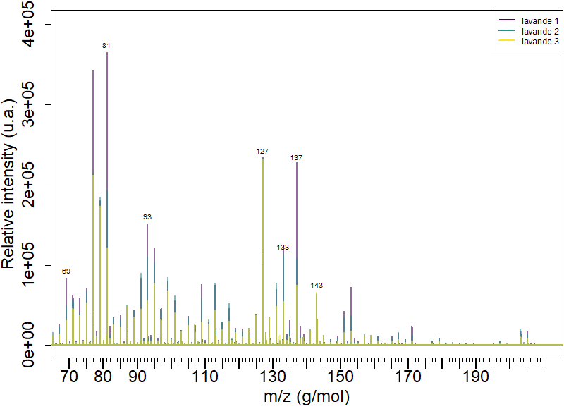

# Présentation de la PTR-ToF-MS {#chap2}

De très nombreux projets de recherche issus du CeMEB nécessitent l'analyse de **C**omposés **O**rganiques **V**olatils (COV ou VOC en anglais) aussi communément appelés "odeurs". Les COVs sont omniprésents dans la nature et permettent, avec les autres sens, une organisation du vivant en agissant comme vecteur d'information de la médiation chimique. Par l'acquisition d'un PTR-ToF-MS, la communauté souhaitait lever trois verrous techniques :

-   l'appareil permet un fonctionnement en flux continu avec une résolution temporelle très fine (fréquence d'analyse allant jusqu'à 10 scans par seconde), permettant ainsi le suivi des cinétiques d'émissions de COV. Cet instrument simplifie drastiquement et affine les expériences cinétiques effectuées par des mesures moyennées de GC-MS;\
-   le PTR-ToF-MS possède une excellente résolution en masse qui facilite l'identification des molécules. Un spectre est composé de plus de 140 000 mesures de masses couvrant une large gamme des masses des COV biologiques (de 70 à 500 m/z). L'appareil possède donc une résolution environ mille fois supérieure par rapport à un simple quadripôle (PTR-MS ou GC-MS) qui fournit des m/z à l'unité de masse atomique (uma ou Dalton Da);\
-   le seuil de détection extrêmement bas, de l'ordre du ppt (part per trillion), permet une sensibilité adaptée à la mesure de traces.

## Une brève histoire de la PTR-ToF-MS

Durant la décennie 1990, l'*Institut für Ionenphysik der Leopold-Franzens-Universität* d'Innsbruck en Autriche développe un nouvel instrument pour l'analyse chimique des gaz. En travaillant avec la *Universitiitsklinik fiir Innere Medizin*, l'équipe menée par Lindinger développe un spectromètre en phase gazeuse qui ionise les molécules grâce à un gaz neutre ([@lindinger_1991] et [@lindinger_1993]). Ils comprennent rapidement l'avantage d'utiliser un proton (apporté à la réaction sous la forme H~3~O^+^) par rapport aux ions Kr^+^ et Xe^+^. Ils publient une sorte de preuve de concept en 1994 [@lagg_1994] et détaillent plus finement l'instrumentation et les réactions chimiques [@hansel_1995][^ptr_tof_ms-1]. En 1998 sort l'article qui fait désormais référence, [@lindinger_1998a], signé par le trio Lindinger, Hansel et Jordan (et sa version courte [@lindinger_1998]).

[^ptr_tof_ms-1]: avec des remerciements incroyables

Ionicon commercialise la même année le premier PTR-MS. Cette technique se déploie rapidement dans les sciences de l'atmosphère, médicales et biotech ([@babcock_2001]) permettant la détection de traces de COV. Rapide et sensible, la PTR-MS élimine certains désavantages de la GC-MS. Cependant, la PTR-MS détecte de la masse nominale des ions. Un échantillon complexe peut contenir plusieurs ions isobares[^ptr_tof_ms-2]. Il convient alors de gagner en résolution de masse et séparer ces isobares. [@jordan_2009] revient sur les tentatives les plus concluantes ([@blake_2004], [@ennis_2005], [@inomata_2006] et [@tanimoto_2007] ) avant de proposer son approche : la PTR-ToF-MS. Développé en collaboration avec la précédente équipe, le minutieux article de [@graus_2010] conclu superbement la vingtaine d'années de développement nécessaire à cette technique. Les années suivantes permettront simplement une amélioration des différentes parties de l'instrument.

[^ptr_tof_ms-2]: molécules possédant un nombre de nucléons identique.

Par ailleurs, c'est au tour des mathématiciens d'apporter leur contribution et en particulier à l'équipe de Cappellin avec deux articles. Le premier, [@cappellin_2010], permet de mieux estimer la masse exacte de chaque ion détecté. Le seconde, [@cappellin_2011], offre une méthodologie détaillée de l'utilisation du PTR-ToF-MS de l'acquisition à la fin de l'analyse. Puis en 2015, [@holzinger_2015] propose un logiciel pour l'analyse des data mais cette tentative n'a pas été suivie par la communauté d'utilisateurs. Il existe désormais un nombre important d'articles utilisant la PTR-ToF-MS. Bien entendu, des outils communs de chimiométrie ont été utilisés pour renforcer les résultats, [@deuscher_2019]. Mais cela sera abordé dans le chapitre suivant.

Je suppose que la prochaine avancée majeure viendra d'une technologie permettant de discriminer les isomères[^ptr_tof_ms-3] [@amt-14-133-2021] [^ptr_tof_ms-4]. Par exemple, cela permettrait de séparer les différents monoterpènes omniprésents dans les émissions végétales et qui nous concernent particulièrement en écologie chimique. Actuellement, ce désavantage est comblé par le couplage de la PTR-ToF-MS avec une seconde technique d'analyse chimique. Ce court historique montre toutefois que la collaboration entre physiciens, chimistes, biologistes et mathématiciens est fructueuse et promise à un bel avenir.

[^ptr_tof_ms-3]: molécules partageant la même formule brute mais avec un agencement tridimensionnel différent.

[^ptr_tof_ms-4]: si un mémoire de master permettait la science fiction, j'aurais évidemment développé quelques idées à propos de capteurs de champs électromagnétiques ou de spectromètres optiques à la place des capteurs MS actuels.

## Instrumentation générale

Comme nous l'avons vu précédemment, le PTR-ToF-MS est conçu pour analyser finement la masse moléculaire des échantillons. Pour cela l'instrument aspire un débit d'air constant de 100 ml/min[^ptr_tof_ms-5]. Cet *air in* sur la figure \@ref(schemavocus) peut être connecté à un gaz zéro pour diluer un échantillon trop concentré (pour éviter la saturation) ou à  un gaz étalon pour l'étalonnage de l'instrument. Le flux d'air est ensuite injecté dans le réacteur (*FIMR* pour *focusing ion-molecule reactor*). Dans cette chambre, des ions H^+^ issus d'eau ultra pure sont également injectés à débit constant afin d'ioniser les molécules de l'échantillon (*Proton-Transfer-Reaction*).

[^ptr_tof_ms-5]: ou sccm, pour *standard cubic centimeters per minute*

{#schemavocus}

Il est important de comprendre que, contrairement à une ionisation par électron[^ptr_tof_ms-6], il n'y a quasiment pas de fragmentation moléculaire. C'est une ionisation douce, comme en ESI (ElectroSpray Ionization) fréquemment utilisée en LC-MS. Les ions ont "une unité de masse molaire de plus"(un proton) que les ions moléculaires. Par exemple, le linalol, un COV fortement produit par la lavande, a une masse molaire de 154,249 g/mol mais sera detecté à 155,256 g/mol. Par ailleurs, le nombre d'ions MH^+^ détectés dépend du taux de protonation de la molécule M. Sous forme d'ions, l'échantillon peut être focalisé par un champ électromagnétique généré par un quadripôle et envoyé dans la partie ToF.

[^ptr_tof_ms-6]: comme c'est le cas en ionisation électronique fréquemment utilisée en GC-MS.

Une fois dans la colonne, l'énergie potentielle d'un pulse électromagnétique à 25kHz est convertie en énergie cinétique par les ions propulsés. À énergie constante, la masse fait la différence lors de la mesure du temps de vol (ToF, figure \@ref(schemaToF)). Ainsi les ions les moins lourds arrivent en premiers sur le détecteur. Le comptage du nombre de coups sur le détecteur donne l'intensité par unité de temps. Un étalonnage, avec des ions moléculaires étalons, permet de convertir le *temps de vol* en *masse*, ce qui permet par la suite d'analyser les masses des échantillons inconnus. 

{#schemaToF}

Pour une compréhension plus exhaustive, je recommande la lecture des articles de @hansel_1995 pour la partie PTR-MS, de @graus_2010 pour la partie ToF et de @krechmer_2018 spécifique à l'instrument utilisé au CEFE.

## Présentation des spectres

{#lavMS}  

Nous pouvons à présent nous intéresser aux spectres à analyser. J'ai représenté sur la figure \@ref(lavMS) un spectre de trois plants de lavandes acquis autour de 8h du matin fin juin. Une figure identique mais dynamique peut se télécharger [ici](https://mycore.core-cloud.net/index.php/s/qBZ4IkVWguXQiDB)^[il faut télécharger le fichier puis l'ouvrir avec un navigateur internet.]. Cette figure dynamique permet d'effectuer des zooms afin d'avoir une compréhension plus précise qu'avec la simple figure \@ref(lavMS).  

Les pics sont extrêmement fins et centrés sur les masses exactes des ions. Les pics issus des ions isobares se regroupent autour des masses unitaires, soumis à une loi centrale limite locale. Cela s'explique facilement au regard de la masse exacte des atomes composants les COV (H, C, O pour l'essentiel) sur le [tableau de Mendeleiev](https://fr.wikipedia.org/wiki/Tableau_p%C3%A9riodique_des_%C3%A9l%C3%A9ments#/media/Fichier:Tableau_p%C3%A9riodique_des_%C3%A9l%C3%A9ments.svg)^[https://www.youtube.com/watch?v=0lNuTSz6KVM]. Il y a plusieurs ordres de grandeur^[entre 10 et 10^6^] entre les pics très intenses et ceux faibles. Cette intensité ne présage rien quand à l'importance de ce pic dans l'analyse.  

La plage spectrale de l'instrument est de 70 à 500 g/mol. Cela est limité pour des raisons techniques alors qu'il y a de nombreuses molécules d'intérêt de masses inférieures à 70g/mol. En revanche la limite, communément acceptée, fixée pour les molécules volatiles et de 300 g/mol. Ces considérations prises en compte, nous obtenons pour chaque spectre un vecteur brut de 158 768 points. Ces spectres sont réduits, après alignement (voir section \@ref(ExplicationGen) et \@ref(alignmnt) ) à une taille inférieure à 50 000 points tout en gardant une résolution de 10^-3^ g/mol. De plus, la PTR-ToF-MS a été développée afin d'analyser des cinétiques d'émissions. Dans nos cas, nous enregistrons des spectres de quelques secondes consécutivement durant plusieurs minutes à plusieurs jours. Pour une expérience, nous générons ainsi des dizaines, voir des milliers, de spectres. Ceci étant, nous pouvons dès à présent percevoir les problèmes liés aux temps de calculs que nous allons rencontrer et la nécessité de développer des outils optimisés pour analyser de tels objets.  

## Technique rivale ou alliée de la GC-MS ?

La métabolomique est le maillon le plus exhaustif de la chaîne -omic. Il se concentre sur l'analyse des molécules, les *métabolites*, produites par un système biologique. Les deux domaines d'analyse sont la résonance magnétique nucléaire (NMR) et la spectrométrie de masse (MS). Pour l'analyse des COV en spectrométrie de masse en écologie chimique, la technique de GC-MS est la plus utilisée à l'heure actuelle. La GC-MS, utilisée depuis des décennies, est largement implantée dans le paysage scientifique international. De plus, de nombreux logiciels performants^[MZmine pour n'en citer qu'un] existent. Il est légitime de se poser la question de la nécessité d'utilisation des deux techniques^[ou de façon moins prosaïque : pourquoi diable les physiciens ne restent pas sagement avec leurs bosons et viennent régulièrement embêter leurs collègues avec des idées nouvelles ?].  

Premièrement, la GC-MS accumule les COV dans des pièges chimiques^[qui se présentent sous différentes formes en fonction des utilisations] puis les analyse dans un second temps. La durée d'accumulation dans le piège est de l'ordre de la dizaine de minutes jusqu'à 24h. La PTR-ToF-MS a une sensibilité accrue permettant l'acquisition de spectres à une cadence de 25kHz. Afin d'augmenter le ratio signal sur bruit et de drastiquement réduire la quantité de data générée, ces spectres sont additionnés les uns aux autres sur des durées d'acquisitions plus longues^[typiquement de l'ordre d'une à trente secondes]. En répétant ces acquisitions, la PTR-ToF-MS permet l'analyse cinétique d'un phénomène grâce à un pas de temps d'accumulation très court. Analyse statique contre analyse quasi-dynamique. Le prix de cette sensibilité est comme bien souvent une sélectivité dégradée. Ainsi la GC-MS, *a contrario* de la PTR-ToF-MS, peut discriminer certains isomères, principalement grâce à sa phase de chromatographie. Cela est permis grâce à la fragmentation des molécules lors de l'étape d'ionisation par un électron qui intervient après la phase de chromatographie.  

Bien que les molécules analysées soient les mêmes, les approches et résultats sont donc bien différents. De plus, il est souvent intelligent de croiser ces deux techniques [@majchrzak_2018]. De façon empirique, le PTR-ToF-MS analyse séquentiellement plusieurs échantillons. Il est aisé de collecter les COV pour le GC-MS juste avant ou après une séquence dédiée au PTR-ToF-MS. Nous pouvons ainsi, par exemple, obtenir deux ou trois analyses ponctuelles de GC-MS lors d'une journée entière d'analyse PTR-ToF-MS. Nous combinons la sensibilité et la spécificité des deux techniques.  

Les données obtenues en GC-MS sont donc plus complexes qu'en PTR-ToF-MS. Chaque échantillon est représenté par une matrice ayant une dimension pour le temps de rétention et une dimension pour le spectre de masse. Il n'est donc pas possible de réutiliser tels quels les outils numériques de la GC-MS. Cependant, il serait dommage de ne pas piquer les idées déjà existantes. J'ai donc créée un package R spécifique à l'analyse des données du PTR-ToF-MS mais en m'inspirant largement de ce qui se fait sur d'autres techniques : workflow (idée piquée à MZmine), bucketing (pratique courante dans la RMN), chimiométrie (largement utilisée pour l'analyse des spectres optiques) ; ou en utilisant des packages destinés à d'autres méthodes (MALDIquant conçu pour le traitement des spectres MALDI-ToF)

## package proVOC

Comme expliqué dans la section sur la science ouverte ( \@ref(opensci)), ce package peut se retrouver [sur ce dépôt Git](https://github.com/JHuguenin/provoc). 

###  Explication générale {#ExplicationGen}

L'objectif de proVOC est de permettre une vue d'ensemble rapide^[proVOC : **P**erform a **R**apid **O**verview of the **V**olatil **O**rganic **C**ompound] pour les utilisateurs pressés d'analyser *leurs* données sous R sans avoir besoin d'une grande connaissance de ce langage. La fonction *import_sp()* constitue la première étape de l'analyse. Les données contenues dans des fichiers au format *hdf5* générés par notre instrument sont importés dans l'espace de travail [@fischer_2021]. Après cette étape, les spectres sont automatiquement alignés puis réduits. Les détails à propos de l'alignement des spectres sont donnés dans la section \@ref(alignmnt). Pour l'étape de réduction, j'ai défini empiriquement de supprimer chaque colonne (masse) qui ne possédait aucune ligne (intensité) supérieure à un seuil. Ce seuil est calculé pour chaque jeu de données comme égal à 20 fois l'écart-type médian de chaque masse^[*cf.* "calculation of threshold" dans la fonction *reduction2()*]. Il est probable que cette étape de réduction puisse être optimisée d'avantage mais je reviens sur les perspectives d'améliorations du package dans la section dédiée, \@ref(perspec).  

Passées ces étapes, la fonction met en forme les données dans un objet *list*, récupère les metadata (date et heure d'acquisition) puis détecte les pics grâce à la fonction *detectPeaks()* du package **MALDIquant** et calcule les *Area Under the Curve*(AUC) grâce à la function *AUC()* du package **DescTools**. Enfin, cette liste nommée "sp" est sauvegardée en .Rdata. Ce travail préliminaire peut être long.  

Une fois effectué, l'import permet à l'utilisateur de lancer facilement une série d'analyse pour explorer rapidement son jeu de données. Pour cela, il lui suffit de modifier des options dans un workflow : 

```{r eval = FALSE, include = TRUE, purl = FALSE, warning = FALSE}
# Workflow pour l'analyse :
mt <- list("h5" = mt_h5,                                # Don't touch
           "acq" = which(mt_h5$use4analysis == TRUE),   # Don't touch
           "wd" = sp$h5$wd,                             # Don't touch
           #__________________________________#
```
[...]
```{r eval = FALSE, include = TRUE, purl = FALSE, warning = FALSE}
# graphe pour visualiser les spectres de masses de chaque acquisition :
           "view_plot" = FALSE,   # Si TRUE, graphe moyen de chaque acquisition,
                                  # sinon precisez le numero d'une ou plusieurs
                                              # acquistion(s). (ex :
                                              # c(200,300,400)
                                              # mt_h5$end
                                              # c(mt_h5$start, mt_h5$end)
           "view_each.group" = FALSE,   # FALSE ou le nom d'une meta colonne 
                                        # ("XXX" de mt_h5$XXX) pour les graphes
                                        # larges ou centres sur un seul pic.
           "view_plot_xmin" = 70,
           "view_plot_xmax" = 250,
           # ou ...
           "view_plot_peak" = FALSE, # c(59,73,81,93,109,127,137,143,153) ou
                                     # False ou c(61,...) Permet de ne regarder
                                     # qu'un seul pic
           #__________________________________#
```
[...]
```{r eval = FALSE, include = TRUE, purl = FALSE, warning = FALSE}
           # ICA
           "ICA" = FALSE,
           "ICA_AUC" = TRUE,
           "nc" = 6
           #__________________________________#
           )

PTR_MS_analysis(sp, mt)       # debute les analyses
```

L'objet *mt* peut être sauvegardé pour se souvenir des paramètres utilisés lors de l'analyse. Nous pouvons détailler ci-dessous quelques options.

###  Analyse AUC {#analyseAUC}

```{r eval = FALSE, include = TRUE, purl = FALSE, warning = FALSE}
#__________________________________#

# Aire sous la courbe (AUC) :
"AUC" = TRUE,
"AUC_plot_exp" = FALSE,     # Si TRUE, l'axe 'y' est exponentionnelle.
"AUC_each.group" = FALSE,  # Si l'argument est le nom d'un meta colonne
                            # ( "XXX" de mt_h5$XXX) chaque groupe de cette
                            # colonne aura son graphe. Sinon FALSE.
"AUC_each.Mass" = TRUE,     # Si TRUE, un graphe pour chaque masse
"M.num" = c(81, 137, 153),  # Les masses analysees (utilise pour AUC)
"AUC_plot_dy" = TRUE,       # Si FALSE, plot exporter en .tiff. Si TRUE, plot
                            # exporter en .html (dynamique)
"AUC_format" = "date",      # L'axe du graphe est base sur une duree ("time")
                            # ou sur la date et heure d'acquisition ("date")
#__________________________________#
```


{#AUCplot}  

La figure \@ref(AUCplot) montre l'évolution quotidienne de l'émission des molécules de masse 137 (de 136.5 à 137.5) de trois plants de figuiers dont le cadre expérimental est décrit section \@ref(explav). Chaque plante est analysée par cycle de 384 secondes composé de 24 acquisitions de 16 secondes (regroupées en trois parties pour des raisons techniques). Vous pouvez télécharger cette figure [ici](https://mycore.core-cloud.net/index.php/s/9DMytdUSXYtYJ4U) afin de zoomer plus facilement. 

Nous pouvons observer que le début de chaque cycle d'enregistrement est systématiquement impacté par la mesure précédente et le volume mort des lignes de mesures. Nous pouvons justifier ce biais expérimental et donc le supprimer en ne prenant pas les 8 premières acquisitions de chaque cycle.  

Ce bloc d'options est vraiment très simple d'utilisation. En jouant sur les masses et les modalités incluses dans le graphe, les utilisateurs arrivent facilement à appréhender l'évolution des COV de leur système. Pour autant, nous reviendrons en \@ref(perspec) sur l'utilisation de l'AUC et sa méthode de calcul qui impacte grandement ce module.

###  Étalonnage, régression linéaire et rapport automatisé

```{r eval = FALSE, include = TRUE, purl = FALSE, warning = FALSE}
#__________________________________#
# Calibration
"calibration" = FALSE,
"cal_rapport" = TRUE,     # Redige un rapport automatise pour evaluer la qualite de la calibration
"cal_plot_exp" = TRUE,    # Les axes x et y sont exponentiels ?
"M.conc" = c(1.008, 1.018, 1.013, 1.014, 1.013, 1.013, 1.015, 1.006, 1.007,
             0.994, 1.013),      # La concentration, en ppm, de chaque masse,
                                 # par defaut C = 1.000 ppm. (1 ou FALSE)
#__________________________________#
```

Afin de vérifier l'étalonnage de l'appareil, j'utilise un gaz étalon que je dilue avec un gaz zéro lors des mesures. J'ai développé un script pour analyser cet étalonnage. La sortie de ce script se fait sous forme de [rapports automatisés](https://mycore.core-cloud.net/index.php/s/ztNMJqgnfvQG44Z) basés sur des régressions linéaires simples. J'ai eu pour projet de développer cela en combinant les différentes masses et en proposant des tests de validation. La base de ce script peut également être reprise pour mesurer la concentration de différentes molécules. Ceci étant, le manque de temps et le côté monovariable ont largement freiné ce projet. D'autant que nous allons le voir, le travail ne manque pas. 

###  Perspectives {#perspec}

Dans cette partie, je n'ai pas développé les analyses plus poussées (alignement et chimiométrie) qui sont expliquées dans le chapitre suivant. Nous avons simplement vu le principe de base de la PTR-ToF-MS ainsi que les modules de base de l'analyse : obtenir le graphe des spectres de masses, le suivi des AUC et le calcul de concentration. Le package proVOC permet d'effectuer ces opérations de façon simple et sans rien coder. De plus, il met à disposition les jeux de données pour que les utilisateurs puissent soit appliquer leur propre traitement soit utiliser des modules avancés.  

Le package a été conçu pour assurer une reproductibilité des analyses. Lors de la conception de la structure du package, nous avions peu de recul sur l'utilisation du PTR-ToF-MS. Désormais, je suis convaincu qu'il me faut développer la version 2 très prochainement. Trois grosses modifications vont être effectuées.

La première est assez technique et concerne l'importation de données :
```{r eval = FALSE, include = TRUE, purl = FALSE, warning = FALSE}
# Data importation and reduction ####
  f_h5 <- dir("h5") %>% grep(".h5",.)     # localise h5 files
  ls_h5 <- vector("list", length(f_h5))   # the acquisitions listes
  names(ls_h5) <- nm_ls(f_h5)             # and the name

  for (i in 1:length(ls_h5)){
    ls_h5[[i]] <- paste0("h5/",dir("h5")[f_h5[i]]) %>% H5Fopen() # files import
  }

  mt_h5 <- meta_h5(ls_h5)         # make the meta file
  sp <- sp_red(ls_h5,mt_h5)       # spectra reduction

  sp$h5 <- list(f_h5 = f_h5,
                ls_h5 = ls_h5,
                mt_h5 = mt_h5,
                wd = getwd())

  h5closeAll()                   # close the connexion with the h5 files.
                                 # ls_h5 become NULL
```

Les fonctions *H5open()* et *H5close()* du package **rhdf5** permettent d'ouvrir les formats hdf5 afin de les importer puis de les fermer. La fonction *sp_red()*, que j'ai écrite, est une meta fonction qui permet d'importer les spectres, les meta data, d'aligner les spectres, de supprimer les données inutiles et des détecter les peaks. Comme nous pouvons le voir, elle se trouve en sandwich entre l'ouverture de toutes les datas et la fermeture des données. Cette maladresse occupe de la RAM inutilement et ralentit beaucoup cette étape. Pour autant, toucher à la fonction qui importe les données et les met en forme est une opération risquée qui met en péril la fonctionnalité des fonctions ultérieures. 

La seconde modification sera sur le calcul de l'AUC. Initialement, je voulais trouver un moyen simple d'exprimer les 50 000 points des spectres en une valeur plus acceptable pour de l'analyse chimiométrique. J'avais donc piqué l'idée du bucketing des communautés de RMN en calculant l'AUC par masse unitaire (de M-0.5 à M+0.5). Cela permet d'obtenir une matrice de seulement 400 colonnes environ. En réalité, cela masque les cinétiques des molécules isobares qui est un des points forts de la technique PTR-**ToF**-MS. De plus, j'ai découvert après coup une fonction performante pour détecter les pics (*detectPeaks()*). Je peux donc remplacer les AUC unitaires par l'intensité des pics. Il n'y aura alors plus qu'une confusion sur les isomères mais qui correspond aux limites techniques de l'instrument. J'aimerais également travailler sur l'AUC des pics et leur déconvolution afin de savoir si de l'information y est cachée. 

La dernière modification se fera sur la structure : 
```{r eval = FALSE, include = TRUE, purl = FALSE, warning = FALSE}
PTR_MS_analysis(sp, mt)       # debute les analyses
```
Une seule fonction permet de lancer la série d'analyses précisée dans le workflow *mt* sur les data de l'élément *sp*. La fonction *PTR_MS_analysis()* ne retourne rien, si ce n'est des graphiques, des fichiers *.csv* ou des rapports automatiques. J'aimerais inclure le workflow à l'intérieur de l'objet *sp* et le compléter au fur et à mesure. Ainsi l'utilisateur pourrait lancer des opérations à la volée, par exemple (en reprenant le bloc AUC de la section \@ref(analyseAUC)) :

```{r eval = FALSE, include = TRUE, purl = FALSE, warning = FALSE}
# Aire sous la courbe (AUC) :
sp <- sp_AUC(sp, AUC_plot_exp = FALSE, AUC_each.group = FALSE, AUC_each.Mass = TRUE, M.num = c(81, 137, 153), AUC_plot_dy = TRUE, AUC_format = "date")
```

Cette forme franchement plus digeste permettra d'inclure plus simplement une analyse PTR-ToF-MS dans un script ou un rapport Rmarkdown. 

J'espère, avec ces modifications importantes, rendre l'analyse plus optimisée en temps et répondre mieux aux attentes des utilisateurs. Ce package est sur GitHub depuis septembre 2020. J'ai fait peu de pub car je connais ses limites et je souhaiterais corriger ses principaux défauts avant de le proposer aux collègues des autres centres de recherche avec qui nous avons des contacts. Les retours sur les quelques démonstrations effectuées sont très positifs et proVOC permettra (je l'espère) de répondre positivement à un réel besoin. De plus proVOC est complètement cohérent avec les principes de l'open science développés au chapitre \@ref(chap1) et intègre des analyses chimiométriques qui sont détaillées au chapitre \@ref(chap3).