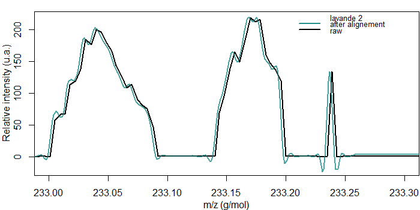
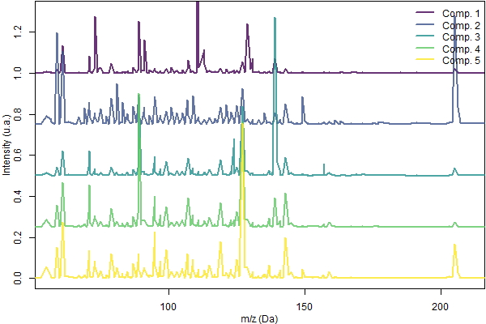
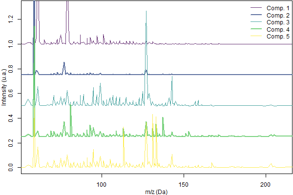
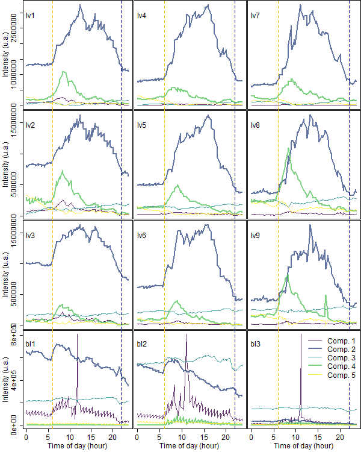

# Méthodes Multivariées {#chap3}

Nous allons à présent nous intéresser aux algorithmes utilisés pour traiter les jeux de données générés par le PTR-ToF-MS. Ce chapitre est divisé en deux parties. Lors de l'écriture du package, j'avais travaillé sur différentes méthodes d'alignement avant de m'arrêter sur l'une d'elles. Le début de ce stage m'a permis de reprendre ce travail avec des idées nouvelles que je présenterai dans une première partie. La deuxième partie présente l'utilisation de la chimiométrie pour l'analyse de données, d'abord avec la PCA   puis avec deux méthodes moins connues, l'ICA et la MCR qui ont l'avantage chacune d'essayer de décomposer les données en produits purs.

## Alignement et sélection de variables {#alignmnt}

Actuellement, le package utilise la fonction *alignSpectra()* du package **MALDIquant**. L'alignement est fortement lié à la détection de pic. Soit le modèle utilisé n'est pas optimum et ajoute ou supprime des pics. Soit il crée un décalage trop important en alignant mal les pics ce qui génére de la confusion lors de l'étape d'identification.   

*alignSpectra()* est performant mais rencontre des limites sur les pics de faible ratio signal sur bruit, comme nous pouvons le voir sur la figure \@ref(lav). Le bruit intensifie l'effet vaguelette et génère de l'ambiguïté sur le nombre de pics présents. Par ailleurs, la fonction créée des pics négatifs qui faussent le calcul de l'AUC.  

{#lav}  

J'ai trouvé un article très intéressant de @picaud_2018 qui propose un algorithme pour nettoyer la ligne de base, aligner les pics et les détecter. L'article explique les problèmes de faire ces trois étapes successivement et propose donc une alternative. Nous avons discuté avec l'auteur de sa solution. Malheureusement, le script est écrit en C++. Il est possible d'utiliser ce langage sous R, via Rcpp par exemple, mais cela aurait demandé un peu trop de temps. Pour l'instant, cette solution a été mise de côté mais pourra être explorée plus tard.  

De plus, Jean-Michel Roger m'a proposé une approche basée sur l'algorithme COVSEL [@roger_2011] pour résoudre notre problème.  Cette méthode permet de recaler les masses en recalculant l'abscisse pour chaque spectre. On observe cependant dans la théorie (équations 4 et 5) que l'on va devoir diagonaliser une matrice d'environ 150000x150000 points, essentiellement composée de zéro. Cette opération est impossible à effectuer avec un ordinateur de bureau. Pour autant, la solution que j'ai trouvée est d'utiliser l'algorithme COVSEL sur une toute petite partie du spectre et de le faire glisser sur toute la longueur. Cette technique fonctionne mais n'est pas du tout optimisée et prend un temps non acceptable (environ une minute par spectre).  

Finalement, nous avons fait le choix de garder la fonction *alignSpectra()* de **MALDIquant**. De plus, ce package nous permet d'avoir une liste de tous les pics détectés. Ainsi, nous avons pour un même jeu de données, trois matrices à utiliser pour les analyses chimiométriques :  

-   la matrice alignée (composée d'environ 50 000 masses) ; *(Mc)*
-   les AUC (~340 masses unitaires non nulles) ; *(Ma)*
-   les pics (~300 pics, qui peuvent être des isobares). *(Mp)*  

Pour une étude chimiométrique, nous pouvons discuter de la pertinence des jeux de données. Avec une matrice alignée *Mc*, on peut estimer que les algorithmes puissants des chimiométriciens vont détecter de petites variations négligées par les méthodes de détection de pics. Les *Mc* peuvent donc détecter les traces de COV. Cependant les deux autres matrices *Ma* et *Mp* (AUC ou pics) possèdent un nombre de colonnes réduit de presque deux ordres de grandeur. De plus, le grand avantage du PTR-ToF-MS est d'obtenir des spectres ayant une excellente résolution de masse (10^-3^Dalton). Nous pouvons donc utiliser les matrices *Ma* et *Mp* pour les analyses chimiométriques avec une préférence pour les secondes.  

Maintenant que les outils pour détecter les pics et les outils d'analyses sont fonctionnels pour les jeux de données du PTR-ToF-MS, il serait très intéressant d'analyser (via une MCR par exemple) comment la modification des paramètres de la fonction *detectPeaks()* (de **MALDIquant**) influe sur les résultats de chimiométrie.  

##  Analyses Chimiométriques  

### Analyse en Composante Principale (ACP)  

L'[ACP](https://fr.wikipedia.org/wiki/Analyse_en_composantes_principales)^[Wikipédia est un haut lieu de la science ouverte] est une méthode bien connue et enseignée dans toutes les formations d'analyses statistiques. Elle permet d'obtenir rapidement une vision de la variance des données. ProVOC permet d'effectuer une ACP sur le jeu de donnée de l'utilisateur. Un exemplaire peut être consulté [ici](https://mycore.core-cloud.net/index.php/s/WlN1djlyneKgCdL). Il décrit le jeu de données utilisé dans la section \@ref(explav) et y sera commenté dans cette même section. L'ACP peut être appliquée à la matrice alignée avec un temps de calcul acceptable.

Cependant, le résultat de l'ACP est un pur objet mathématique qui est souvent très compliqué à interpréter correctement. Je me suis donc intéressé à deux algorithmes que je souhaitais utiliser depuis [longtemps](https://www.gfsv.net/gfsv-2014-paris/pr%C3%A9sentations/chimiom%C3%A9trie-analyse-en-ligne/)^[très probablement depuis le GFSV 2014]. 

### Multivariate Curve Resolution (MCR)  

{#schMCR}

La MCR est une famille de méthodes qui cherche à décomposer l'ensemble des spectres en plusieurs sous-ensembles de produits purs. La figure \@ref(schMCR) issue de l'article de @dejuan_2014 permet de bien comprendre l'objectif d'une MCR. La matrice D, obtenue par l'expérience, est l'expression de deux produits purs S~A~^T^ et S~B~^T^ (deux bouquets de COV pour notre PTR-ToF-MS) de concentration C~A~ et C~B~, qui sont les quatre vecteurs que nous cherchons à connaître^[et dont nous ne connaissons rien.]. Les étapes de l'équation sont décrites dans l'article précédemment cité.  

De plus, la MCR permet l'ajout de contraintes telles que la "non-négativité" qui permet de ne pas avoir de composantes négatives dans les S~i~^T^ (fréquent en ACP) ou la contrainte "d'égalité" qui permet par exemple de renseigner un spectre pur de référence.  

Un autre aspect très important de la MCR est de comprendre les trois "ambigüités" liées à l'algorithme :  

- l'ambigüité de **permutation**. Il n'y a pas d'ordre dans les spectres purs et leur concentration associée. Le spectre S~i~^T^ ne représente pas plus ou moins l'ensemble du jeu de donnée que le spectre S~j~^T^.  
- l'ambigüité d'**intensité**. L'intensité du spectre pur S~i~ et sa concentration C~i~ peuvent être multipliées conjointement par les facteurs k~i~ et k~i~^-1^. La MCR ne peut donner qu'une concentration relative.  
- l'ambigüité de **rotation**. Il est possible d'introduire une matrice inversible **R** dans les équations :  
$$D = CS^T + E$$
$$D = (CR)(R^{-1} S^T) + E$$
Puisque l'algorithme de la MCR cherche à minimiser l'erreur **E**, la matrice **R** ne fait pas varier **E** mais change la composition des résultats.  

Les contraintes permettent de lever en partie ces ambigüités.  

La MCR permet donc d'initier les matrices **C** et **S^T^**. Cette opération est utilisée dans un ensemble itératif MCR-ALS (alternating least squares) qui permet d'optimiser les résultats en fonction des contraintes utilisées. Par ailleurs, le nombres de composantes est un paramètre essentiel qui correspond véritablement à un nombre de phénomènes naturels. Il ne peut pas être déterminé arbitrairement à l'inverse du nombre de CP dans une ACP. Théoriquement, une MCR peut être effectuée avec le jeu de données de la matrice alignée. Cependant, avec un ordinateur de bureau, les calculs sont assez longs. 

Un excellent complément d'information se trouve dans le livre 
@ruckebusch_2016 et en particulier les chapitres 2 [@dejuan_2016], 3 [@kucheryavskiy_2016] et 14 [@hugelier_2016]. De plus, le chapitre 7 [@rutledge_2016] présente l'algorithme de l'ICA. Ces deux algorithmes cherchent tous deux à extraire des spectres purs. Pour autant, les deux approches sont différentes et génèrent parfois des incompréhensions entre les communautés.   

### Independent Components Analysis (ICA)

L'objectif principal de l'ICA est de retrouver les *signaux sources* mélangés à l'intérieur du jeu de données et la proportion de chacun d'eux. Pour cela, l'ICA s'interresse à la distribution de l'intensité du signal sur un histogramme (*cf.* Fig2 de @rutledge_2016). Selon la loi centrale limite, plus l'histogramme tend vers une répartition gaussienne, plus il y a de chances que ce signal soit du bruit. Inversement, moins la répartition est gaussienne, plus le signal correspond à un signal source. De plus, comme pour une ACP, l'ICA cherche à obtenir des signaux sources indépendants, et donc orthogonaux. Contrairement à la MCR, l'ICA n'impose pas de contrainte. La phrase de [@rutledge_2016] permet de bien comprendre la différence entre les deux méthodes : *This is because while MCR aims to extract the signals of pure compounds, ICA extracts signals reflecting underlying **independent phenomena**, which may in fact be combinations of the signals of several pure compounds*.^[En effet, alors que la MCR vise à extraire les composés purs, l'ICA extrait les signaux reflétant des **phénomènes indépendants** sous-jacents, qui peuvent en fait être des combinaisons des signaux de plusieurs composés purs.]  
Il existe plusieurs algorithmes itératifs qui utilisent l'ICA, [@wang_2008] et [@al-saegh_2015]. Cependant, l'agorithme JADE [@cardoso_1993] est probablement le plus utilisé pour l'ICA, [@rutledge_2013] et [@rutledge_2015]. Un package [JADE](https://cran.r-project.org/web/packages/JADE/JADE.pdf) pour R est déposé et maintenu sur le CRAN. Le principe de JADE est de décomposé la matrice **X** (le jeu de données expérimentales) en utilisant les loadings d'une ACP. Ces loadings sont centrés et normés puis arrangés pour former un tenseur d'ordre 4. De façon itérative, JADE va ensuite optimiser ces loadings pour les rendre indépendants.  

Cette description succincte permet très vite de comprendre que réaliser un tenseur d'ordre 4 à base de vecteur de 55000 points risque d'être problématique. L'ICA ne peut se faire que sur une matrice réduite comme l'AUC ou les pics détectés dans l'optique d'une utilisation avec un ordinateur de bureau.  

## Applications

J'ai testé les packages [**alsace**](https://www.bioconductor.org/packages/devel/bioc/vignettes/alsace/inst/doc/alsace.pdf) [@wehrens_2015], **ChemometricsWithR** et **ALS** anfin d'utiliser la MCR-ALS avec R. Les packages **alsace** et **ChemometricsWithR** sont du même auteur mais le premier est encore soutenu. **alsace** utilise le package **ALS** pour le calcul et le rend compatible directement avec le format "liste" donné en sortie de la fonction *detectPeaks()*. Le package **alsace** applique par défaut uniquement la contrainte de non-negativité.

Pour la partie ICA, j'ai utilisé le package [**rnirs**](https://github.com/mlesnoff/rnirs)^[écrit par Mathieu Lesnoff du Cirad de Montpellier] dans le package proVOC. Ce module "ICA" est implémenté mais peu fonctionnel et ne travaille qu'avec les AUC. De plus, le package **rnirs** est en cours de transformation et sera bientôt soutenu par la communauté ChemHouse à laquelle je contribue modestement. Toutefois, j'ai échangé avec D.Rutledge qui m'a envoyé un [rapport](https://mycore.core-cloud.net/index.php/s/zNxcxNhgdUIonFu) en utilisant les spectres entiers de l'expérience de lavandes (*cf* ci-dessous). Ces résultats sont difficiles à interpréter à cause du format de présentation. Les acquisition des 12 spectres ayant été concatenées. Cependant, on remarque des formes relativement similaires à celles produites par les spectres purs de la MCR que nous allons voir par la suite.

### Détermination du nombre de composantes  

 Je n'ai pas trouvé de méthode théorique pour définir le nombre de composante. Une méthode proposée^[mais dont je n'ai pas la source.] pour ajuster le nombre de composés est de procéder comme avec une ACP, c'est-à-dire, déduire en fonction du pourcentage exprimé de chaque CP la séparation entre le "signal" et le "bruit". La package **alsace** propose la fonction *smallComps()* pour aider à fixer ce nombre. Je pense qu'on se trouve dans la limite mathématique de l'exercice et qu'il est bon de discuter avec le praticien. J'effectue alors plusieurs cycles en incrémentant le nombre de composantes. En interprétant les résultats, nous arrivons à déterminer une limite entre ce qui reflète un phénomène probable et ce qui est probablement du bruit.

### Suivi de la floraison {#anaalm}  

{#mcrSalm}

Cette expérience est expliquée plus en détail dans la section \@ref(expalm). Les données ont ensuite été traitées avec proVOC puis analysées par MCR. La figure \@ref(mcrSalm) représente les composés purs de l'expérience. Pour qui a l'habitude des analyses ACP, il paraît évident que l'interprétation de ce genre de résultat est plus intuitive.  

{#mcrCalm}

La figure \@ref(mcrCalm) permet de voir l'évolution des cinq composantes au cours du week-end d'analyse. Il y a deux artefacts sur ces résultats. Premièrement, nous observons des oscillations très régulières. Bien que nous n'en n'ayons pas compris la nature exacte, cela vient du système de climatisation. Secondement, nous avons effectué une mesure "blanche" durant 30 minutes chaque 4h. Cela se remarque très facilement, par exemple sur la composante n°2, nous pouvons voir un pic un peu avant 22h suivi d'un autre un peu avant 2h du matin.   

Passés ces artefacts, nous pouvons interpréter les phénomènes. La composante n°2 (en bleu nuit) est monotone décroissante. Ces composés sont ceux de la pollution extérieure à notre système biologique et chassés par le flux d'air zéro en quelques heures. Les composantes n°5 et 4 (jaune et vert) sont celles du bourgeon avec l'alternance phase de nuit/phase de jour (lever du soleil : 07h24). La floraison a très probablement eu lieu aux alentours de 14h. Nous avons deux indices qui laissent penser ça. Premièrement, les cinétiques des composantes 4 et 5 sont perturbées entre 14 et 18h. Secondement, le bouquet d'odeurs de la fleur d'amande, traduit par la composante n°3 augmente à partir de ce moment. En outre, la composante n°1 montre des phénomènes très ponctuels que nous n'avons pas identifiés.  

Ces hypothèses d'interprétation nécessitent encore une analyse fine d'identification des composantes mais ces résultats ont été un moteur d'intérêt à la fois pour la PTR-ToF-MS et pour la MCR-ALS.

### Analyse de l'émission journalière des lavandes {#analav}

{#mcrSlav}

{#mcrClav}

L'expérience est décrite dans la section \@ref(explav). Pour analyser cette expérience, j'ai procédé de la même façon que pour l'analyse de la floraison de l'amandier. Après discussion avec la doctorante expérimentatrice, nous avons conclu que cinq composantes étaient un nombre optimum pour interpréter les résultats. Ces composantes sont représentées sur la figure \@ref(mcrSlav). J'ai rendu plus visible les composantes n°2 (bleu nuit) et 4 (vert) qui sont les plus intéressantes pour notre cas. La figure \@ref(mcrClav) permet l'interprétation de ces résultats. Pour faciliter la lecture, j'ai placé sur une même colonne les unités expérimentales enregistrées le même jour et sur une même ligne les unités expérimentales enregistrées dans une même chambre. Les lignes 1 à 4 correspondent aux chambres 1 à 4. Les colonnes 1 à 3 correspondent aux jours 1, 3 et 5. Les abréviations "lv" et "bl" désignent respectivement les unités expérimentales où se trouvent une lavande et celles servant de blanc.  

La composante n°1 (violet) est un artefact qui se produit principalement dans les unités "blanches" avec un fort pic à 11h. Quelques fluctuations se retrouvent dans les autres unités, principalement lors du jour 1. La composante n°3 (turquoise) est un bruit de fond que l'on retrouve dans toutes les analyses^[contrairement à l'expérience précédente, ces échantillons sont mal isolés du reste de la serre. De plus la serre sert de stockage des autres plants de lavandes et de figuiers]. La composante n°5 (jaune) est plus compliquée à interpréter. Elle se retrouve dans les unités "lavandes" mais pas dans les unités "blanches".  

Une fois ces trois composantes analysées, nous pouvons nous attarder sur les composantes n°2 et 4. Les expériences ayant été effectuées en juin, j'ai placé deux lignes verticales pour marquer le lever (en jaune) et le coucher (en bleu) du soleil. Le lever du jour est parfaitement synchronisé avec l'émission des COV n°2 et 4. La composante 2 est émise durant toute la journée. La plante arrive en quelques heures à un plateau d'émission puis anticipe une diminution avec le déclin du jour. Il est très intéressant de comparer les profils d'un même jour. Par exemple, nous observons un creux dans les trois profils du jour 1 aux alentours de 15h. La composante 4 suit un profil d'émission différent de la composante 2. L'émission des COV arrive en 2h à un maximum puis décroit très rapidement par la suite pour retrouver une émission quasi nulle à midi.   

Le système circadien de la lavande est bien connu, tout comme le fait que sa production de COV dépend des facteurs extérieurs comme l'ensoleillement [@guitton_2010]. Cependant, le résultat d'une double émission au sein d'une même journée n'a jamais, au meilleur de notre connaissance, été mis si distinctement en valeur. De plus, ce résultat se retrouve sur 9 unités expérimentales réparties en 3 jours et 3 chambres et contrôlées avec un blanc. Si l'expérience de la floraison n'était qu'un test, cette expérience est très concluante.   

## Discussions

Les analyses MCR sont satisfaisantes mais nécessitent encore d'être complétées par un travail d'indexations des pics. Cela permettra de consolider d'un point de vue biologique l'hypothèse du double cycle d'émission des lavandes. De mon côté, je peux renforcer l'analyse par plusieurs façon. D'une part, nous avons vu que les [rapports automatisés de l'ACP](https://mycore.core-cloud.net/index.php/s/WlN1djlyneKgCdL ) effectués par **proVOC** sont assez sommaires. Le changement de structure du package permettra d'appliquer plus facilement des pré-traitements et des sélections de variables à l'ACP. Cet outil reste un excellent moyen d'exploration à l'aveugle des jeux de données, notamment pour détecter les outliers.   
Ensuite, il reste un travail, probablement à effectuer en commun avec les membres de Chemhouse, pour optimiser les analyses MCR et  [ICA](https://mycore.core-cloud.net/index.php/s/zNxcxNhgdUIonFu)^[ici le rapport de l'analyse effectuée par Douglas Rutledge.] puis en croisant les résultats de l'analyse biologique avec les spectres purs (MCR) et les signaux sources (ICA) afin de définir au plus juste quel algorithme décrit le mieux les lois naturelles.

